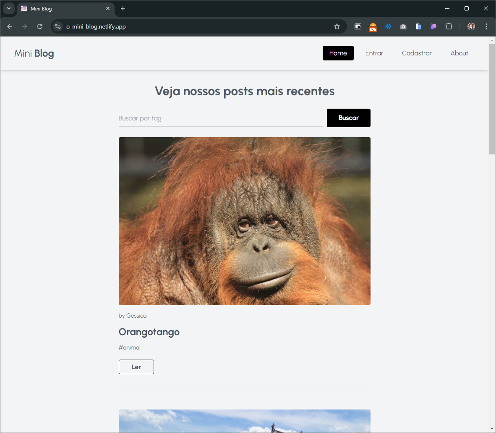
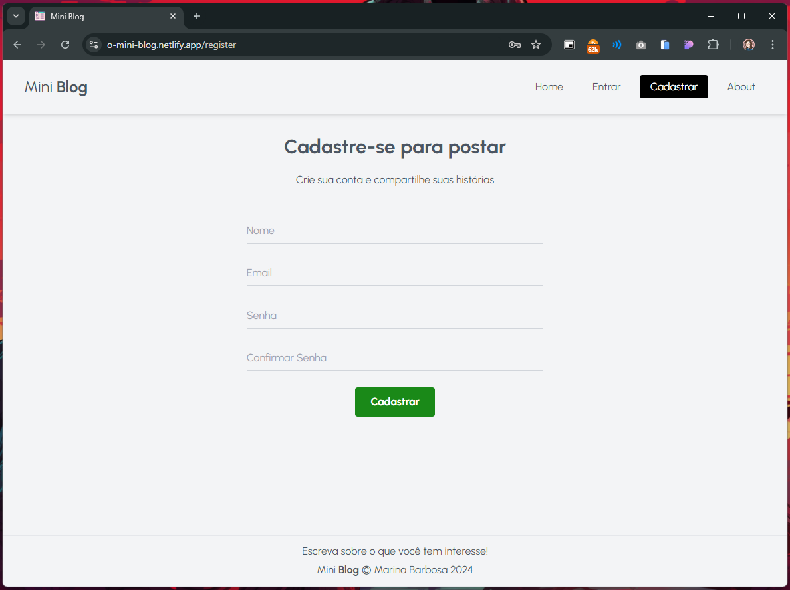
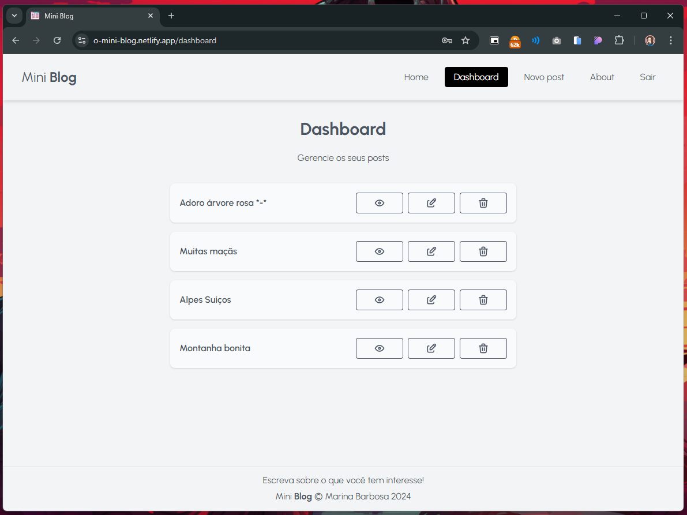
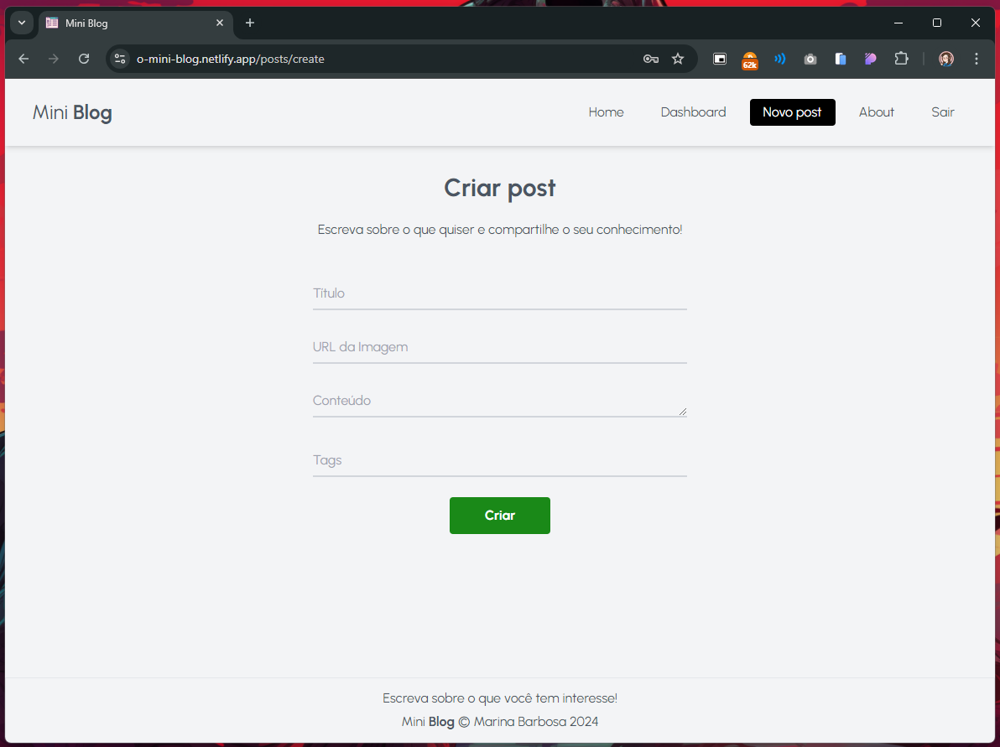

# Mini **Blog**

Este é um projeto de um mini-blog desenvolvido em React e Firebase, com deploy realizado na Netlify. Ele foi criado como parte de um curso de React que realizei, com o objetivo de aprender e praticar o desenvolvimento com React.

### Deploy: https://o-mini-blog.netlify.app/

<br>

## Funcionalidades
- **Home:** Exibe todos os posts disponíveis.
- **Post individual:** Visualiza um post específico.
- **Busca por Tags:** Realize buscas de posts utilizando tags.
- **Dashboard:** Gerencia todos os posts criados pelo usuário (criar, editar, excluir).
- **Login/Registro:** Autenticação de usuários para gerenciar posts.
- **Sobre:** Página com informações sobre o projeto.
- **Criar Post:** Permite adicionar novos posts com título, imagem, conteúdo e tags.
- **Editar Post:** Permite modificar um post existente.
- **Excluir Post:** Remove permanentemente um post criado pelo usuário.

<br>

## Tecnologias Utilizadas
- **React:** Framework JavaScript para construção da interface de usuário.
- **Firebase:** Backend para autenticação e armazenamento de dados.
- **TailwindCSS:** Framework CSS para estilização.
- **React Router:** Gerenciamento de rotas para navegação entre as páginas.
- **Tabler Icons:** Biblioteca de ícones usada para a interface.
- **Netlify:** Plataforma utilizada para o deploy do projeto.

<br>






<br>

## Instalação
- Clone o repositório:
```
git clone git@github.com:marina-barbosa/mini-blog.git
```
- Acesse o diretório do projeto:
```
cd mini-blog
```
- Instale as dependências:
```
npm install
```
- Inicie o servidor de desenvolvimento:
```
npm run dev
```
- Acesse: 
### http://localhost:5173/

- Scripts Disponíveis
```
npm run dev: Inicia o servidor de desenvolvimento.
npm run build: Realiza a build para produção.
npm run lint: Executa o linter para análise de código.
npm run preview: Visualiza a build da aplicação.
```

<br>

## Próximas Funcionalidades
Aqui estão algumas funcionalidades que planejo adicionar no futuro:

- **Comentários em posts:** Permitir que os usuários comentem nos posts.
- **Likes em posts:** Permitir que os usuários curtam posts.
- **Avatar de usuário:** Permitir que os usuários definam e exibam avatares personalizados.
- **Perfil de usuário:** Oferecer a funcionalidade para edição de informações pessoais, como nome, senha, e-mail e avatar.
- **Notificações (Toastify):** Implementar notificações amigáveis para feedback visual, como confirmação de ações ou erros.
- **Personalização de postagens:** Expandir as opções de formatação e personalização na criação de posts, oferecendo mais flexibilidade na escrita, incluindo:
  - **Negrito, itálico e cabeçalhos:** Para uma melhor organização e destaque de texto.
  - **Listas ordenadas e não ordenadas:** Para organizar conteúdo em tópicos.
  - **Blocos de citação:** Para destacar trechos importantes.
  - **Blocos de código com destaque de sintaxe:** Permitir a inclusão de trechos de código com realce para diferentes linguagens de programação.
  - **Alinhamento de texto:** Opções para alinhar o texto à esquerda, ao centro ou à direita.
  - **Espaçamento entre parágrafos e linhas:** Maior controle sobre a estrutura visual do post.
  - **Tabelas:** Suporte para criação de tabelas para organização de dados.
  - **Markdown:** Suporte para formatação de texto com Markdown.
  - **Editor Rich Text (WYSIWYG):** Um editor visual que mostra o post formatado em tempo real.

<br>

## Contribuições
Contribuições são bem-vindas! Sinta-se à vontade para abrir issues ou fazer pull requests.